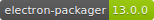
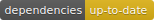
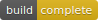
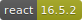
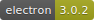
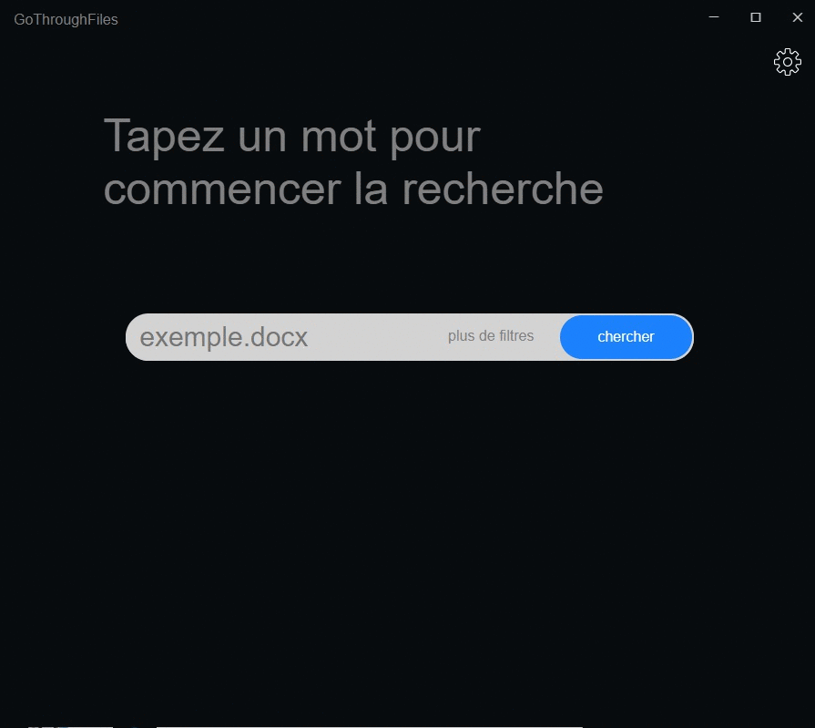

<p align="center">
  
</p>


| **Auteurs** | Dardan Iljazi, David Niembro, Anel Muminovic |
| :--- | :---: |
| **Date de début du projet** | 31 août 2018 |
| **Date de fin de projet** | 14 décembre 2018 |
| **Date de reddition du rapport** | 14 décembre 2018 |


## Documentation

Lien du Gitbook -&gt; [Gitbook](https://gothroughfiles.gitbook.io)

    

## Tables des matières


* [Page de garde](page-de-garde.md)
* [Introduction](untitled.md)
* [Explications détaillées](developpement.md)
* [Réalisation des cas d'utilisation](cas-dutilisation.md)
* [Mode d'emploi utilisateur](mode-demploi-utilisateur.md)
* [Installation développement](installation-developpement.md)
* [Problèmes rencontrés](problemes-rencontres.md)
* [Conclusion](conclusion.md)
* [Références](references.md)

### Aperçu



### Installation

Si vous voulez reprendre notre projet et le continuer.

Faites un git clone à partir de de l'adresse.

```text
git clone https://github.com/DavidNiembro/GoThroughFiles.git
yarn install
yarn start
```

`yarn start` pour lancer notre application.

### License

[](http://badges.mit-license.org/)

* [**MIT license**](http://opensource.org/licenses/mit-license.php)
* Copyright 2018 © [C](http://fvcproductions.com/)PNV


