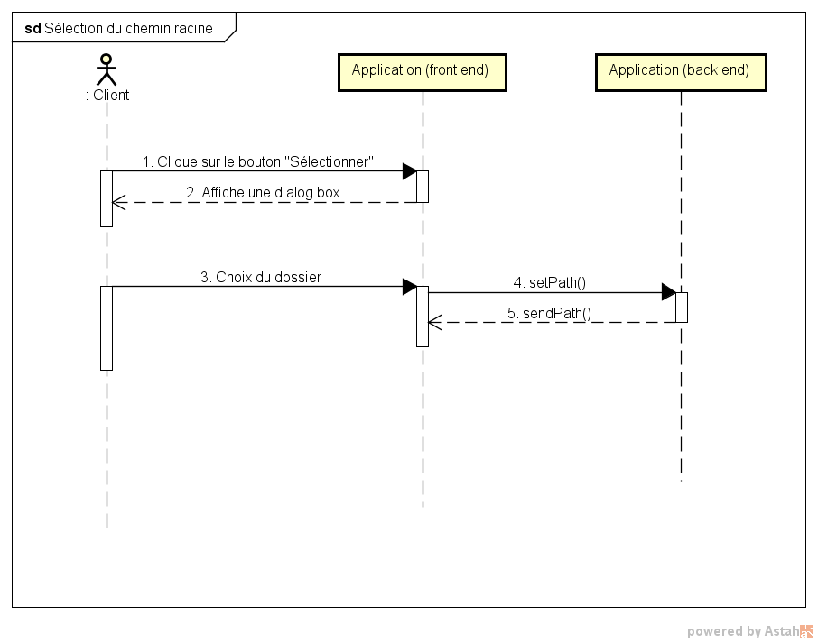

# Réalisation des cas d'utilisation

## **1. Cas d'utilisation “Sélection/Modification du chemin racine”**

<table>
  <thead>
    <tr>
      <th style="text-align:left"><b>ID:</b>
      </th>
      <th style="text-align:left"><b>1</b>
      </th>
    </tr>
  </thead>
  <tbody>
    <tr>
      <td style="text-align:left">Titre:</td>
      <td style="text-align:left">Sélection du dossier de recherche par l’utilisateur</td>
    </tr>
    <tr>
      <td style="text-align:left">Description:</td>
      <td style="text-align:left">Recherche par titre ou par contenu des fichiers dans le dossier et sous-dossier
        du dossier racine choisi</td>
    </tr>
    <tr>
      <td style="text-align:left">Acteur principal:</td>
      <td style="text-align:left">Une personne</td>
    </tr>
    <tr>
      <td style="text-align:left">Préconditions:</td>
      <td style="text-align:left">Aucunes</td>
    </tr>
    <tr>
      <td style="text-align:left">Postconditions:</td>
      <td style="text-align:left">Effectuer la recherche</td>
    </tr>
    <tr>
      <td style="text-align:left">Scénario nominal:</td>
      <td style="text-align:left">
        <ol>
          <li>L'utilisateur clique sur le bouton "Sélectionner"</li>
          <li>Le système affiche une dialog box</li>
          <li>L'utilisateur choisit un dossier</li>
          <li>Le système enregistre le chemin du dossier</li>
          <li>Le système affiche le path dans l'input</li>
        </ol>
      </td>
    </tr>
    <tr>
      <td style="text-align:left">Scénarios alternatifs :</td>
      <td style="text-align:left">4a. Le chemin du dossier n'existe plus ou n'est plus accessible</td>
    </tr>
    <tr>
      <td style="text-align:left">Statut:</td>
      <td style="text-align:left">Validé</td>
    </tr>
  </tbody>
</table>### **Maquettes** 

### \*\*\*\*

### **Analyse du scénario**

#### **Diagramme de séquence système** 

### **La phase de tests**

<table>
  <thead>
    <tr>
      <th style="text-align:left"><b>Test à effectuer</b>
      </th>
      <th style="text-align:left">
        
<b>Résultat</b>
        

        
<b>escompté</b>
        

      </th>
      <th style="text-align:left">
        
<b>Résultat</b>
        

        
<b>obtenu</b>
        

      </th>
      <th style="text-align:left"><b>Constatation</b>
      </th>
      <th style="text-align:left"></th>
    </tr>
  </thead>
  <tbody>
    <tr>
      <td style="text-align:left"><b>Généralités</b>
      </td>
      <td style="text-align:left"></td>
      <td style="text-align:left"></td>
      <td style="text-align:left"></td>
      <td style="text-align:left"></td>
    </tr>
    <tr>
      <td style="text-align:left"></td>
      <td style="text-align:left"><b>Sélection du chemin racine </b>
      </td>
      <td style="text-align:left"><b>Pris en compte du path dans la recherche</b>
      </td>
      <td style="text-align:left"><b>Succès</b>
      </td>
      <td style="text-align:left"></td>
    </tr>
    <tr>
      <td style="text-align:left"><b>Mise à jour de l’input avec le nouveau nom</b>
      </td>
      <td style="text-align:left"><b>Succès</b>
      </td>
      <td style="text-align:left"></td>
      <td style="text-align:left"></td>
      <td style="text-align:left"></td>
    </tr>
  </tbody>
</table>## **2. Cas d'utilisation “Recherche par titre”**

<table>
  <thead>
    <tr>
      <th style="text-align:left">ID:</th>
      <th style="text-align:left">2</th>
    </tr>
  </thead>
  <tbody>
    <tr>
      <td style="text-align:left">Titre:</td>
      <td style="text-align:left">Recherche dans le dossier racine</td>
    </tr>
    <tr>
      <td style="text-align:left">Description:</td>
      <td style="text-align:left">Recherche par titre ou par contenu des fichiers dans le dossier et sous-dossier
        du dossier racine choisi</td>
    </tr>
    <tr>
      <td style="text-align:left">Acteur principal:</td>
      <td style="text-align:left">Une personne</td>
    </tr>
    <tr>
      <td style="text-align:left">Préconditions:</td>
      <td style="text-align:left">Sélectionner le chemin du dossier racine</td>
    </tr>
    <tr>
      <td style="text-align:left">Postconditions:</td>
      <td style="text-align:left">Affichage du résultat</td>
    </tr>
    <tr>
      <td style="text-align:left">Scénario nominal:</td>
      <td style="text-align:left">
        <ol>
          <li>L'utilisateur entre du texte dans l'input</li>
          <li>L'utilisateur clique sur Chercher</li>
          <li>Le système va chercher les titres correspondant à la recherche</li>
          <li>Le système va afficher les résultats de la recherche</li>
        </ol>
      </td>
    </tr>
    <tr>
      <td style="text-align:left">Scénarios alternatifs :</td>
      <td style="text-align:left">
        
4a. La recherche ne se fait pas si il y a une trop grande quantité de
          fichiers à rechercher (Par ex. une recherche sur le disque)

        
3a. Il n'y a pas de titres qui correspondent à la recherche, renvoie 0
          résultat

      </td>
    </tr>
    <tr>
      <td style="text-align:left">Statut:</td>
      <td style="text-align:left">Validé</td>
    </tr>
  </tbody>
</table>### **Maquettes** 

### **Analyse du scénario**

#### **Diagramme de séquence système**

### **La phase de tests**

<table>
  <thead>
    <tr>
      <th style="text-align:left"><b>Test à effectuer</b>
      </th>
      <th style="text-align:left">
        
<b>Résultat</b>
        

        
<b>escompté</b>
        

      </th>
      <th style="text-align:left">
        
<b>Résultat</b>
        

        
<b>obtenu</b>
        

      </th>
      <th style="text-align:left"><b>Constatation</b>
      </th>
    </tr>
  </thead>
  <tbody>
    <tr>
      <td style="text-align:left"><b>Généralités</b>
      </td>
      <td style="text-align:left"></td>
      <td style="text-align:left"></td>
      <td style="text-align:left"></td>
    </tr>
    <tr>
      <td style="text-align:left"><b>Recherche par titre dans un dossier contenant peu de fichiers (~10)</b>
      </td>
      <td style="text-align:left"><b>Avoir bien tous les fichiers contenant le mot affichés</b>
      </td>
      <td style="text-align:left"><b>Succès</b>
      </td>
      <td style="text-align:left"><b></b>
      </td>
    </tr>
    <tr>
      <td style="text-align:left"><b>Recherche par titre dans un dossier contenant près de 10’000 fichiers (9’823)</b>
      </td>
      <td style="text-align:left"><b>Avoir bien tous les fichiers contenant le mot affichés</b>
      </td>
      <td style="text-align:left"><b>Prend plus de temps</b>
      </td>
      <td style="text-align:left"><b></b>
      </td>
    </tr>
  </tbody>
</table>

## **3. Cas d'utilisation “Recherche dans le contenu d’un fichier”**

<table>
  <thead>
    <tr>
      <th style="text-align:left"><b>ID:</b>
      </th>
      <th style="text-align:left"><b>3</b>
      </th>
    </tr>
  </thead>
  <tbody>
    <tr>
      <td style="text-align:left">Titre:</td>
      <td style="text-align:left">Recherche dans contenu d'un fichier</td>
    </tr>
    <tr>
      <td style="text-align:left">Description:</td>
      <td style="text-align:left">Recherche le contenu des fichiers dans le dossier et sous-dossier du dossier
        racine choisi</td>
    </tr>
    <tr>
      <td style="text-align:left">Acteur principal:</td>
      <td style="text-align:left">Une personne</td>
    </tr>
    <tr>
      <td style="text-align:left">Préconditions:</td>
      <td style="text-align:left">Sélectionner le chemin du dossier racine</td>
    </tr>
    <tr>
      <td style="text-align:left">Postconditions:</td>
      <td style="text-align:left">Affichage du résultat</td>
    </tr>
    <tr>
      <td style="text-align:left">Scénario nominal:</td>
      <td style="text-align:left">
        

        <ol>
          <li>L'utilisateur entre du texte dans l'input</li>
          <li>L'utilisateur clique sur Chercher</li>
          <li>Le système va chercher dans les fichiers si il y a le terme correspondant
            à ce qu'il a entré</li>
          <li>Le système va afficher les résultats de la recherche</li>
        </ol>
      </td>
    </tr>
    <tr>
      <td style="text-align:left">Scénarios alternatifs :</td>
      <td style="text-align:left">4a. Il n'y a pas de résultats, renvoie 0 résultat</td>
    </tr>
    <tr>
      <td style="text-align:left">Statut:</td>
      <td style="text-align:left">Validé</td>
    </tr>
  </tbody>
</table>### **Maquettes**

\*\*\*\*

### **Analyse du scénario**

#### **Diagramme de séquence système**

### **La phase de tests**

<table>
  <thead>
    <tr>
      <th style="text-align:left"><b>Test à effectuer</b>
      </th>
      <th style="text-align:left">
        
<b>Résultat</b>
        

        
<b>escompté</b>
        

      </th>
      <th style="text-align:left">
        
<b>Résultat</b>
        

        
<b>obtenu</b>
        

      </th>
      <th style="text-align:left"><b>Constatation</b>
      </th>
      <th style="text-align:left"></th>
    </tr>
  </thead>
  <tbody>
    <tr>
      <td style="text-align:left"><b>Généralités</b>
      </td>
      <td style="text-align:left"></td>
      <td style="text-align:left"></td>
      <td style="text-align:left"></td>
      <td style="text-align:left"></td>
    </tr>
    <tr>
      <td style="text-align:left"></td>
      <td style="text-align:left"><b>Recherche par contenu dans un dossier contenant peu de fichiers (~10)</b>
      </td>
      <td style="text-align:left"><b>Avoir bien tous les fichiers contenant le mot affichés</b>
      </td>
      <td style="text-align:left"><b>Succès</b>
      </td>
      <td style="text-align:left"></td>
    </tr>
    <tr>
      <td style="text-align:left"></td>
      <td style="text-align:left"></td>
      <td style="text-align:left"></td>
      <td style="text-align:left"></td>
      <td style="text-align:left"></td>
    </tr>
    <tr>
      <td style="text-align:left"></td>
      <td style="text-align:left"><b>Recherche par contenu dans un dossier contenant près de 10’000 fichiers (9’823)</b>
      </td>
      <td style="text-align:left"><b>Avoir bien tous les fichiers contenant le mot affichés</b>
      </td>
      <td style="text-align:left"><b>Succès</b>
      </td>
      <td style="text-align:left"><b>Prend beaucoup plus de temps</b>
      </td>
    </tr>
    <tr>
      <td style="text-align:left"></td>
      <td style="text-align:left"></td>
      <td style="text-align:left"></td>
      <td style="text-align:left"></td>
      <td style="text-align:left"></td>
    </tr>
  </tbody>
</table>

## **4. Cas d'utilisation “Lister les résultats de la recherche”**

<table>
  <thead>
    <tr>
      <th style="text-align:left"><b>ID:</b>
      </th>
      <th style="text-align:left"><b>4</b>
      </th>
    </tr>
  </thead>
  <tbody>
    <tr>
      <td style="text-align:left">Titre:</td>
      <td style="text-align:left">Affiche les résultats de la recherche</td>
    </tr>
    <tr>
      <td style="text-align:left">Description:</td>
      <td style="text-align:left">Affichage des résultats sous forme de carte sous la barre de recherche</td>
    </tr>
    <tr>
      <td style="text-align:left">Acteur principal:</td>
      <td style="text-align:left">Une personne</td>
    </tr>
    <tr>
      <td style="text-align:left">Préconditions:</td>
      <td style="text-align:left">Recherche par titre ou par contenu</td>
    </tr>
    <tr>
      <td style="text-align:left">Postconditions:</td>
      <td style="text-align:left">Affichage du résultat</td>
    </tr>
    <tr>
      <td style="text-align:left">Scénario nominal:</td>
      <td style="text-align:left">
        <ol>
          <li>Le système va chercher les fichiers</li>
          <li>Le système va afficher les fichiers</li>
        </ol>
      </td>
    </tr>
    <tr>
      <td style="text-align:left">Scénarios alternatifs :</td>
      <td style="text-align:left">2a. Le système n'affiche rien car aucun résultat</td>
    </tr>
    <tr>
      <td style="text-align:left">Statut:</td>
      <td style="text-align:left">Validé</td>
    </tr>
  </tbody>
</table>### **Maquettes**

\*\*\*\*

### **Analyse du scénario**

####         **Diagramme de séquence système**

### **La phase de tests**

<table>
  <thead>
    <tr>
      <th style="text-align:left"><b>Test à effectuer</b>
      </th>
      <th style="text-align:left">
        
<b>Résultat</b>
        

        
<b>escompté</b>
        

      </th>
      <th style="text-align:left">
        
<b>Résultat</b>
        

        
<b>obtenu</b>
        

      </th>
      <th style="text-align:left"><b>Constatation</b>
      </th>
      <th style="text-align:left"></th>
    </tr>
  </thead>
  <tbody>
    <tr>
      <td style="text-align:left"><b>Généralités</b>
      </td>
      <td style="text-align:left"></td>
      <td style="text-align:left"></td>
      <td style="text-align:left"></td>
      <td style="text-align:left"></td>
    </tr>
    <tr>
      <td style="text-align:left"></td>
      <td style="text-align:left"><b>Faire une recherche dans un dossier contenant peu de fichier (~10)</b>
      </td>
      <td style="text-align:left"><b>Liste de fichiers correspondant à la recherche s’affichent</b>
      </td>
      <td style="text-align:left"><b>Succès</b>
      </td>
      <td style="text-align:left"></td>
    </tr>
    <tr>
      <td style="text-align:left"></td>
      <td style="text-align:left"></td>
      <td style="text-align:left"></td>
      <td style="text-align:left"></td>
      <td style="text-align:left"></td>
    </tr>
    <tr>
      <td style="text-align:left"></td>
      <td style="text-align:left"><b>Faire une recherche dans un dossier contenant près de 10’000 fichiers (9’823)</b>
      </td>
      <td style="text-align:left"><b>Liste de fichiers correspondant à la recherche s’affichent</b>
      </td>
      <td style="text-align:left"><b>Succès</b>
      </td>
      <td style="text-align:left"><b>Prend beaucoup plus de temps</b>
      </td>
    </tr>
    <tr>
      <td style="text-align:left"></td>
      <td style="text-align:left"></td>
      <td style="text-align:left"></td>
      <td style="text-align:left"></td>
      <td style="text-align:left"></td>
    </tr>
  </tbody>
</table>

## **5. Cas d'utilisation “Ouverture du fichier”**

<table>
  <thead>
    <tr>
      <th style="text-align:left"><b>ID:</b>
      </th>
      <th style="text-align:left"><b>5</b>
      </th>
    </tr>
  </thead>
  <tbody>
    <tr>
      <td style="text-align:left">Titre:</td>
      <td style="text-align:left">Ouverture du fichier</td>
    </tr>
    <tr>
      <td style="text-align:left">Description:</td>
      <td style="text-align:left">Ouverture du fichier avec l'application par défaut</td>
    </tr>
    <tr>
      <td style="text-align:left">Acteur principal:</td>
      <td style="text-align:left">Une personne</td>
    </tr>
    <tr>
      <td style="text-align:left">Préconditions:</td>
      <td style="text-align:left">Affichage des résultats de la recherche</td>
    </tr>
    <tr>
      <td style="text-align:left">Postconditions:</td>
      <td style="text-align:left">Aucunes</td>
    </tr>
    <tr>
      <td style="text-align:left">Scénario nominal:</td>
      <td style="text-align:left">
        <ol>
          <li>L'utilisateur clique sur le bouton Ouvrir</li>
          <li>Le système va prendre en compte le type de fichiers</li>
          <li>Ouverture du fichier avec l'application par défaut</li>
        </ol>
      </td>
    </tr>
    <tr>
      <td style="text-align:left">Scénarios alternatifs :</td>
      <td style="text-align:left">2a. Le système va afficher une dialog box pour choisir l'application pour
        ouvrir le fichier</td>
    </tr>
    <tr>
      <td style="text-align:left">Statut:</td>
      <td style="text-align:left">Validé</td>
    </tr>
  </tbody>
</table>### **Maquettes**

### **Analyse du scénario**

#### **Diagramme de séquence système** 

### **La phase de tests**

<table>
  <thead>
    <tr>
      <th style="text-align:left"><b>Test à effectuer</b>
      </th>
      <th style="text-align:left">
        
<b>Résultat</b>
        

        
<b>escompté</b>
        

      </th>
      <th style="text-align:left">
        
<b>Résultat</b>
        

        
<b>obtenu</b>
        

      </th>
      <th style="text-align:left"><b>Constatation</b>
      </th>
      <th style="text-align:left"></th>
    </tr>
  </thead>
  <tbody>
    <tr>
      <td style="text-align:left"><b>Généralités</b>
      </td>
      <td style="text-align:left"></td>
      <td style="text-align:left"></td>
      <td style="text-align:left"></td>
      <td style="text-align:left"></td>
    </tr>
    <tr>
      <td style="text-align:left"></td>
      <td style="text-align:left"><b>Recherche des fichiers avec extension citées dans “4.1 explication détaillée du projet” les ouvrir.</b>
      </td>
      <td style="text-align:left"><b>Les fichiers s’ouvrent bel et bien</b>
      </td>
      <td style="text-align:left"><b>Succès</b>
      </td>
      <td style="text-align:left"></td>
    </tr>
    <tr>
      <td style="text-align:left"></td>
      <td style="text-align:left"></td>
      <td style="text-align:left"></td>
      <td style="text-align:left"></td>
      <td style="text-align:left"></td>
    </tr>
  </tbody>
</table>

