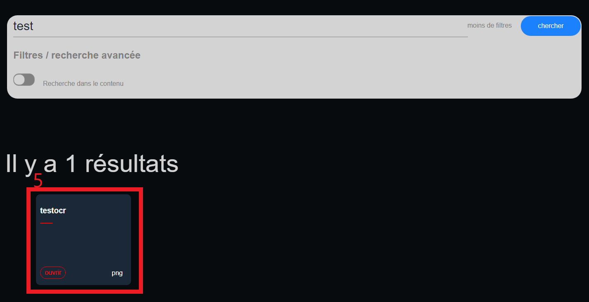
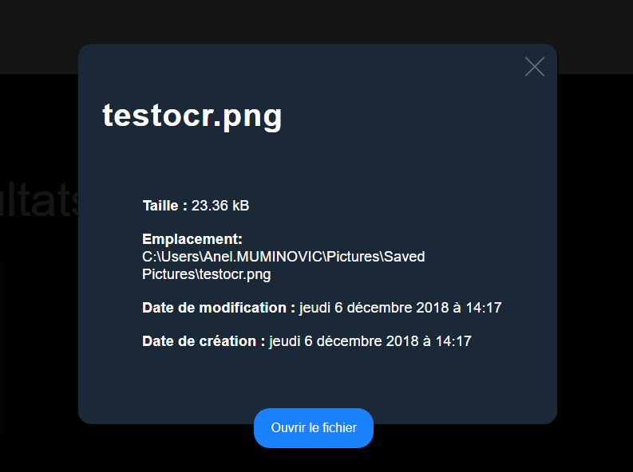

# Mode d'emploi utilisateur

### **Utilisation du produit**

Lorsque le produit est lancé, l’interface \(Figure 2\) s’affiche.

Il est alors possible d’effectuer ces actions:  

1. **Paramètres**
2. **Définir le ou les mots à rechercher**
3. **Choisir un filtre plus avancé pour la recherche \(de base seul le nom de fichier est recherché, “plus de filtres” permet d’étendre cette option au contenu de fichier\).**
4. **Lancer la recherche en appuyant sur le bouton**

Les cas possibles de ces actions sont détaillés dans les pages suivantes  

### **Paramètres**

  

#### **1.1 Sélectionner le dossier de base de recherche**

 ****

Lors de l’appuie sur le bouton bleu “Sélectionner”, une fenêtre apparaît.

Il suffit alors de choisir  le dossier \(où la recherche aura lieu\) et appuyer “Sélectionner un dossier”. L’input \(entouré par un rectangle bleu\) se mettra à jour avec le nouveau lien du dossier.  
Dans le cas où “Annuler” est appuyé, le dossier de recherche reste tel qu’il était à la base.  
****

**1.2 Annuler**

Le bouton bleu “Annuler” permet de revenir sur l’interface principale \(Figure 0\).  
****

**1.3 Suivant**

Le bouton bleu “Suivant” met à jour le dossier de base de recherche. Toutes nouvelles recherches se fera alors dans le dossier affiché dans l’input \(entouré par un rectangle bleu\).  

### **Définir le ou les mots à rechercher**

Lorsque l’on veut trouver un nom de fichier ayant par exemple comme nom “Règlement CPNV”, il suffit de le noter ainsi dans la barre de recherche.  

L’application regardera si le nom du fichier contient au moins le mot “Règlement” et “CPNV”. L’ordre n’est pas important et la recherche est insensible à la case  

**Par exemple \(pour l’ordre pas important\):**

* Le fichier nommé CPNV\_Règlement.pdf sera aussi un résultat pris en compte de la même manière que le fichier nommé Règlement\_CPNV.pdf
* 
**Par exemple \(pour le l’insensibilité à la case\):**

* Le fichier nommé règlement\_cpnv.pdf sera aussi un résultat pris en compte de la même manière que le fichier nommé Règlement\_CPNV.pdf

### **Choisir un filtre plus avancé pour la recherche \(de base seul le nom de fichier est recherché, “plus de filtres” permet d’étendre cette option au contenu de fichier\).**

#### **3.1 Sélectionner le filtre “Recherche dans le contenu”**

  

**4. Lancer la recherche en appuyant sur le bouton**

###  Informations du fichier

#### 5. Cliquez sur la card

#### 

#### Et vous avez les informations du fichier ci-dessous

